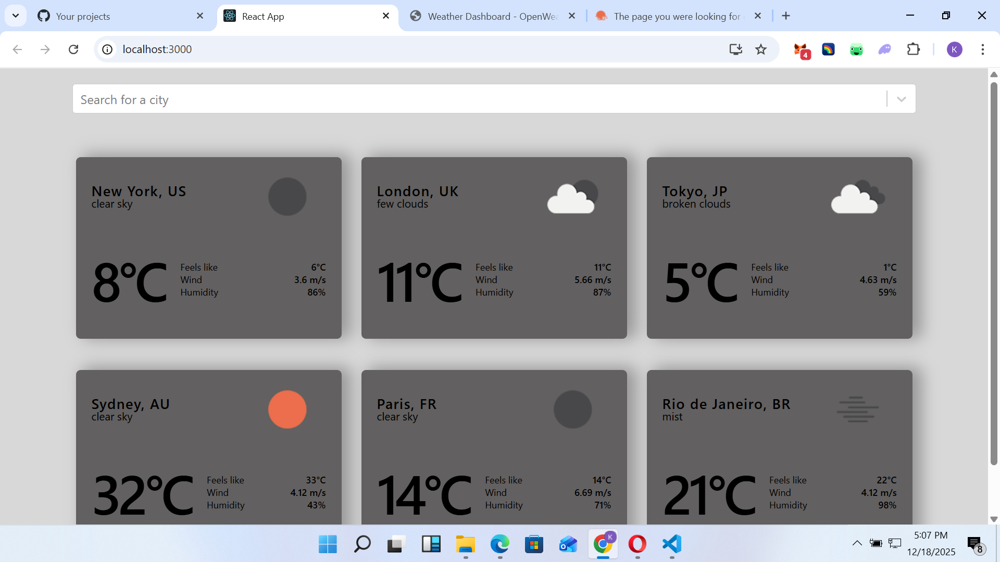
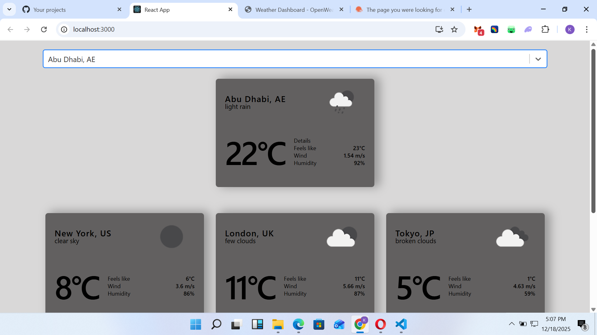

# Geo & Weather Dashboard

A responsive React app that allows users to search for cities worldwide and view real-time weather information. In addition, it displays a selection of random cities’ weather in a dynamic, responsive grid layout.

## Features

- **City Search:** Search for any city worldwide using the GeoDB API.
- **Current Weather:** Display real-time weather for the selected city using the OpenWeather API.
- **Random Cities:** Shows weather for 6 random cities in a 3x3 responsive grid.
- **Responsive Design:** Cards and layout adapt seamlessly to mobile, tablet, and desktop screens.
- **Dynamic Weather Icons:** Weather conditions are visualized using OpenWeather icon codes.
- **Clean UI:** Easy-to-read display of temperature, feels like, wind, and humidity.

## Demo

  
  

## Tech Stack

- **Frontend:** React.js, CSS Grid, AsyncPaginate for city search
- **APIs:**
  - [GeoDB Cities API](https://rapidapi.com/wirefreethought/api/geodb-cities/)
  - [OpenWeather API](https://openweathermap.org/api)
- **Icons:** OpenWeather icon set

## Installation

1. Clone the repository:

```bash
git clone https://github.com/BlessedSiden1234/GeoWeatherDashboard.git
cd geo-weather-dashboard

```

2. Install dependencies:
npm install


3. Create a .env file in the root (optional but recommended) and add your API keys:

REACT_APP_GEODB_API_KEY=your_rapidapi_key
REACT_APP_WEATHER_API_KEY=your_openweather_key

4. Start the development server:

npm start

Open http://localhost:3000 to view the app.
